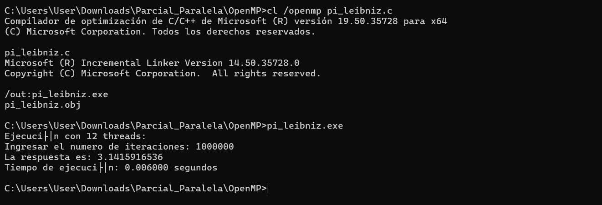
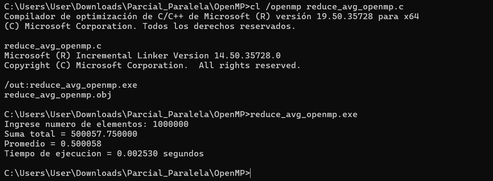
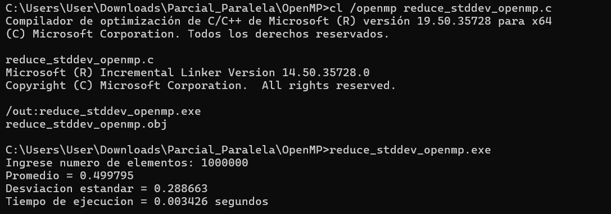
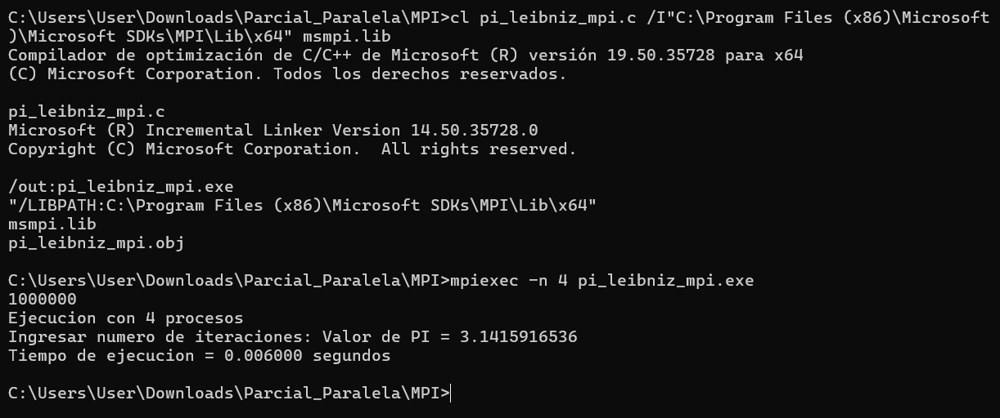
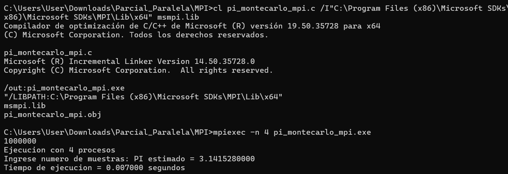
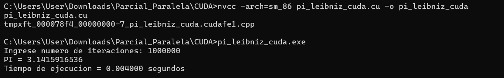
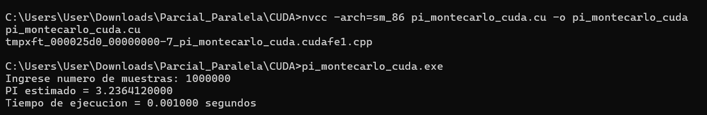

# PARCIAL – PROGRAMACIÓN PARALELA Y DISTRIBUIDA

## Alumno
- Nombre: Zela Flores Gabriel Frank
- Curso: Programación Paralela y Distribuida
- Fecha: 18/05/2026

---

# INTRODUCCIÓN

En el presente trabajo se realizaron implementaciones paralelas utilizando las tecnologías:

- OpenMP
- MPI
- CUDA

El objetivo fue analizar el comportamiento de diferentes algoritmos paralelos utilizando CPU multinúcleo, procesamiento distribuido y aceleración por GPU.

Se trabajó con algoritmos para el cálculo de PI, promedio y desviación estándar, comparando tiempos de ejecución, precisión y facilidad de implementación.

---

# OBJETIVOS

## Objetivo General

Implementar y analizar algoritmos paralelos utilizando OpenMP, MPI y CUDA.

## Objetivos Específicos

- Implementar versiones paralelas de algoritmos matemáticos.
- Comparar tiempos de ejecución entre tecnologías.
- Analizar ventajas y desventajas de OpenMP, MPI y CUDA.
- Comprender el paralelismo en CPU y GPU.

---

# DESARROLLO DEL PARCIAL

---

## 1.1 PI LEIBNIZ – OPENMP
## Fórmula utilizada

\[
\pi = 4 \sum_{i=0}^{n} \frac{(-1)^i}{2i+1}
\]

## Características

- Uso de memoria compartida.
- Paralelización mediante threads.
- División automática de iteraciones.
```bash
cl /openmp pi_leibniz.c
```

## Ejecución

```bash
pi_leibniz.exe
```

## Resultado obtenido

```text
Ejecución con 12 threads:
Ingresar el numero de iteraciones: 1000000
La respuesta es: 3.1415916536
Tiempo de ejecución: 0.006000 segundos
```

## Evidencia



---

# 1.2 REDUCE AVG – OPENMP

Se realizó el cálculo paralelo del promedio de números aleatorios.

## Características

- Uso de reducción paralela.
- Suma compartida con `reduction`.
- Generación de datos aleatorios.


## Compilación

## Compilación

```bash

El algoritmo utiliza la serie de Leibniz para aproximar el valor de PI mediante múltiples hilos.

cl /openmp reduce_avg_openmp.c
```


## Ejecución

```bash
reduce_avg_openmp.exe
```

## Resultado obtenido


```text
Ingrese numero de elementos: 1000000
Suma total = 500057.750000
Promedio = 0.500058
Tiempo de ejecucion = 0.002530 segundos
```

## Evidencia



---

# 1.3 REDUCE STDDEV – OPENMP

Se calculó la desviación estándar usando paralelismo con OpenMP.

## Características

- Cálculo paralelo del promedio.
- Cálculo paralelo de diferencias cuadráticas.
- Uso de `reduction`.

## Compilación

```bash
cl /openmp reduce_stddev_openmp.c
```

## Ejecución

```bash
reduce_stddev_openmp.exe
```

## Resultado obtenido


```text
Ingrese numero de elementos: 1000000
Promedio = 0.499795

Desviacion estandar = 0.288663
Tiempo de ejecucion = 0.003426 segundos
```

## Evidencia



---

# 2. IMPLEMENTACIÓN MPI

## 2.1 PI LEIBNIZ – MPI


Se modificó el algoritmo OpenMP para utilizar MPI y ejecutar múltiples procesos distribuidos.

## Características

- Uso de múltiples procesos.
- Comunicación mediante `MPI_Reduce`.
- Distribución de iteraciones.

## Compilación


```bash
cl pi_leibniz_mpi.c /I"C:\Program Files (x86)\Microsoft SDKs\MPI\Include" /link /LIBPATH:"C:\Program Files (x86)\Microsoft SDKs\MPI\Lib\x64" msmpi.lib
```

## Ejecución

```bash
mpiexec -n 4 pi_leibniz_mpi.exe
```

## Resultado obtenido

```text
Ejecucion con 4 procesos
Ingresar numero de iteraciones: 1000000
Valor de PI = 3.1415916536
Tiempo de ejecucion = 0.006000 segundos
```

## Evidencia



---

# 2.2 PI MONTECARLO – MPI

Se implementó el método Monte Carlo utilizando MPI.

## Fórmula utilizada

\[
\pi \approx 4 \times \frac{\text{Puntos dentro del círculo}}{\text{Total de puntos}}
\]

## Características

- Paralelización por procesos.
- Reducción de resultados con `MPI_Reduce`.
- Generación de puntos aleatorios.

## Compilación

```bash
cl pi_montecarlo_mpi.c /I"C:\Program Files (x86)\Microsoft SDKs\MPI\Include" /link /LIBPATH:"C:\Program Files (x86)\Microsoft SDKs\MPI\Lib\x64" msmpi.lib
```

## Ejecución

```bash
mpiexec -n 4 pi_montecarlo_mpi.exe
```

## Resultado obtenido

```text
Ejecucion con 4 procesos
Ingrese numero de muestras: 1000000
PI estimado = 3.1415280000
Tiempo de ejecucion = 0.007000 segundos
```

## Evidencia



---

# 3. IMPLEMENTACIÓN CUDA

## 3.1 PI LEIBNIZ – CUDA

Se implementó el cálculo de PI utilizando GPU NVIDIA RTX 3050 con CUDA.

## Características

- Paralelismo masivo.
- Miles de hilos GPU.
- Uso de kernels CUDA.
- Memoria GPU con `cudaMalloc`.

## Compilación

```bash
nvcc -arch=sm_86 pi_leibniz_cuda.cu -o pi_leibniz_cuda
```

## Ejecución

```bash
pi_leibniz_cuda.exe
```

## Resultado obtenido

```text
Ingrese numero de iteraciones: 1000000
PI = 3.1415916536
Tiempo de ejecucion = 0.004000 segundos
```

## Evidencia



---

# 3.2 PI MONTECARLO – CUDA

Se implementó el método Monte Carlo utilizando CUDA y GPU.

## Características

- Paralelismo GPU.
- Uso de kernels CUDA.
- Generación pseudoaleatoria en GPU.
- Alto rendimiento.

## Compilación

```bash
nvcc -arch=sm_86 pi_montecarlo_cuda.cu -o pi_montecarlo_cuda
```

## Ejecución

```bash
pi_montecarlo_cuda.exe
```

## Resultado obtenido

```text
Ingrese numero de muestras: 1000000
PI estimado = 3.2364120000
Tiempo de ejecucion = 0.001000 segundos
```

## Evidencia



---

# ANÁLISIS DE IMPLEMENTACIONES

| Implementación | Tecnología | Resultado | Tiempo |
|---|---|---|---|
| PI Leibniz | OpenMP | 3.1415916536 | 0.006 s |
| PI Leibniz | MPI | 3.1415916536 | 0.006 s |
| PI Leibniz | CUDA | 3.1415916536 | 0.004 s |
| Reduce AVG | OpenMP | 0.500058 | 0.002530 s |
| Reduce STDDEV | OpenMP | 0.288663 | 0.003426 s |
| PI MonteCarlo | MPI | 3.1415280000 | 0.007 s |
| PI MonteCarlo | CUDA | 3.2364120000 | 0.001 s |

---

# VENTAJAS Y DESVENTAJAS

# OPENMP

## Ventajas

- Fácil implementación.
- Ideal para CPU multinúcleo.
- Uso sencillo de directivas.
- Buena integración con C/C++.

## Desventajas

- Solo funciona en memoria compartida.
- Menor escalabilidad.
- Limitado comparado con GPU.

---

# MPI

## Ventajas

- Excelente escalabilidad.
- Permite computación distribuida.
- Ideal para clusters.

## Desventajas

- Comunicación compleja.
- Mayor dificultad de programación.
- Mayor sobrecarga de sincronización.

---

# CUDA

## Ventajas

- Alto paralelismo.
- Gran velocidad de procesamiento.
- Excelente rendimiento matemático.

## Desventajas

- Requiere GPU NVIDIA.
- Programación más compleja.
- Manejo explícito de memoria GPU.

---

# COMPARACIÓN GENERAL

## OpenMP

Es la implementación más sencilla y rápida de desarrollar. Resulta adecuada para computadoras con varios núcleos y memoria compartida.

## MPI

Permite distribuir procesos entre múltiples equipos o procesos independientes. Tiene mayor complejidad debido a la comunicación entre procesos.

## CUDA

Ofrece el mayor rendimiento utilizando GPU. Fue la implementación más rápida en los experimentos realizados.

---

# CONCLUSIONES

- OpenMP permitió implementar paralelismo de forma sencilla utilizando múltiples threads.
- MPI permitió ejecutar algoritmos distribuidos utilizando varios procesos.
- CUDA presentó el mejor rendimiento utilizando procesamiento GPU.
- El cálculo de PI mediante Leibniz obtuvo resultados precisos en todas las tecnologías.
- CUDA fue la tecnología con menor tiempo de ejecución.
- MPI y OpenMP son adecuados para CPU, mientras CUDA aprovecha el paralelismo masivo de GPU.

---

# CONCLUSIÓN FINAL

El desarrollo del parcial permitió comprender el funcionamiento de las principales tecnologías de programación paralela modernas. Se logró implementar y ejecutar algoritmos en OpenMP, MPI y CUDA, comparando rendimiento, complejidad y precisión de cada solución.

