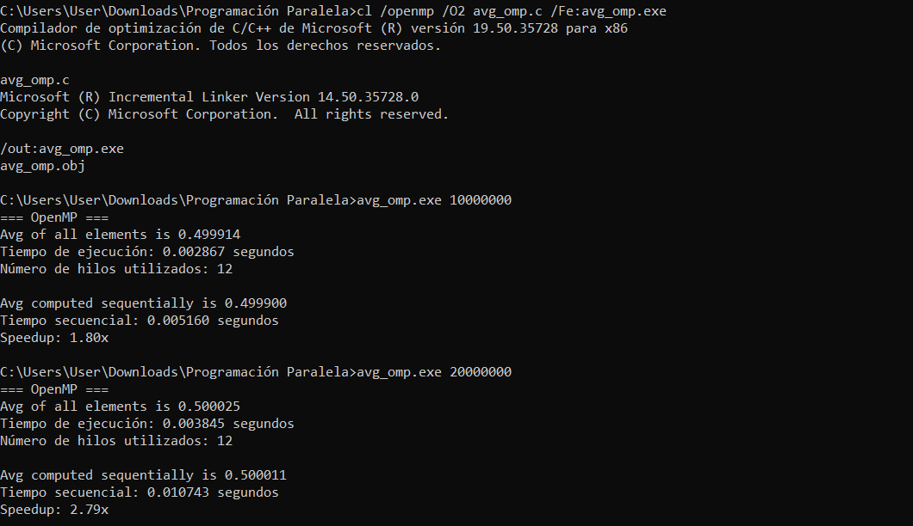

# Computación Paralela - Promedio de Arreglo  
**MPI vs OpenMP**

**Autor:** Gabriel Frank Krisna  
**Fecha:** Mayo 2026

## Objetivo
Modificar el código original `avg.c` (MPI) para que funcione con **OpenMP**, manteniendo el uso de la directiva `reduction`, y comparar ambos modelos de programación paralela.

---

## Archivos entregados
- `avg.c` → Versión original con **MPI**
- `avg_omp.c` → Versión modificada con **OpenMP**

---

## Resultados de Ejecución

### OpenMP (12 hilos)

**Con 10.000.000 elementos:**
- Promedio: **0.499914**
- Tiempo OpenMP: **0.002867 segundos**
- Tiempo Secuencial: **0.005160 segundos**
- **Speedup: 1.80x**

**Con 20.000.000 elementos:**
- Promedio: **0.500025**
- Tiempo OpenMP: **0.003845 segundos**
- Tiempo Secuencial: **0.010743 segundos**
- **Speedup: 2.79x**

*(Puedes agregar aquí una captura de pantalla de la consola)*

---

## Comparación MPI vs OpenMP

| Aspecto                    | MPI (Distribuido)                  | OpenMP (Memoria Compartida)         | Ganador          |
|---------------------------|------------------------------------|-------------------------------------|------------------|
| Facilidad de programación | Más complejo                       | Muy fácil (`#pragma omp`)           | **OpenMP**       |
| Escalabilidad             | Excelente (clusters, muchos nodos) | Limitada al número de núcleos      | **MPI**          |
| Overhead                  | Alto (comunicación por red)        | Bajo                                | **OpenMP**       |
| Uso de memoria            | Mayor (cada proceso tiene su copia)| Más eficiente                       | **OpenMP**       |
| Mejor para                | Supercomputadoras, clústeres      | Computadoras multicore              | Depende          |
| Depuración                | Más difícil                        | Más fácil                           | **OpenMP**       |

### Ventajas y Desventajas

**OpenMP - Ventajas:**
- Mucho más simple de programar (solo directivas del compilador).
- Menor overhead de comunicación.
- Ideal para máquinas con múltiples núcleos (laptops, PCs y servidores).
- Desarrollo rápido y código más legible.
- Excelente para bucles paralelizables como este.

**OpenMP - Desventajas:**
- Solo funciona en memoria compartida (no escala entre múltiples computadoras).
- Limitado por la cantidad de núcleos físicos del procesador.

**MPI - Ventajas:**
- Escala a cientos o miles de nodos (ideal para clústeres y supercomputadoras).
- Modelo muy potente para problemas de gran escala.
- Cada proceso tiene su propia memoria (mejor aislamiento).

**MPI - Desventajas:**
- Mucho más complejo de programar (Scatter, Gather, mensajes, etc.).
- Alto overhead de comunicación.
- Mayor consumo de memoria.

---

## Conclusión

En esta actividad, **OpenMP** demostró ser mucho más sencillo de implementar y más eficiente para una sola máquina, logrando un speedup de hasta **2.79x** con 12 hilos.
- En aplicaciones reales de alto rendimiento se suele usar el modelo **híbrido MPI + OpenMP**.
**Fin del documento.**
---

- Usar **OpenMP** cuando se trabaja en una sola computadora potente.
- Usar **MPI** cuando se necesita escalar en múltiples nodos (clúster).

