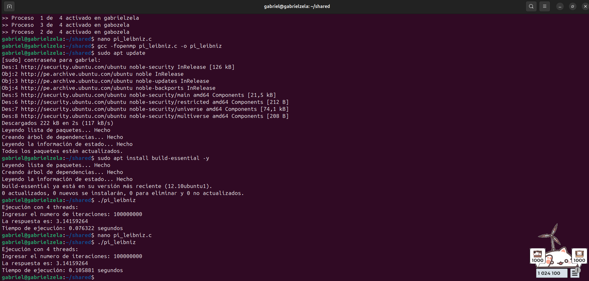

# Programación en OpenMP

## Cálculo del número Pi utilizando la serie de Leibniz

**Curso:** Computación Distribuida y Paralela
**Actividad:** Programación en OpenMP
**Estudiante:** Gabriel Frank Krisna Zela Flores
**Fecha:** 19 de abril de 2026

---

# Objetivo

Modificar el programa `pi_leibniz.c` para que el ciclo `for` sea ejecutado en paralelo utilizando OpenMP.

---

# Descripción

El programa calcula una aproximación del número π utilizando la serie de Leibniz:

El código original distribuía manualmente las iteraciones entre los hilos. La modificación consistió en reemplazar esa lógica por un `for` paralelo utilizando OpenMP.

---

# Código modificado

```c
#include <stdio.h>
#include <time.h>
#include <omp.h>

int main() {
    int numeroHilos;
    clock_t tiempo_inicio, tiempo_final;

    numeroHilos = omp_get_max_threads();
    omp_set_num_threads(numeroHilos);

    double respuesta = 0.0;
    long numeroIteraciones;

    printf("Ejecución con %d threads:\n", numeroHilos);
    printf("Ingresar el numero de iteraciones: ");
    scanf("%ld", &numeroIteraciones);

    tiempo_inicio = clock();

    #pragma omp parallel for reduction(+:respuesta)
    for (long indice = 0; indice < numeroIteraciones; indice++) {

        if (indice % 2 == 0) {
            respuesta += 4.0 / (2.0 * indice + 1.0);
        } else {
            respuesta -= 4.0 / (2.0 * indice + 1.0);
        }
    }

    tiempo_final = clock();

    printf("La respuesta es: %.8f\n", respuesta);
    printf("Tiempo de ejecución: %f segundos\n",
           (double)(tiempo_final - tiempo_inicio) / CLOCKS_PER_SEC);

    return 0;
}
```

---

# Cambio realizado

En el código original, cada hilo calculaba sus iteraciones manualmente con:

```c
for(long indice = idHilo; indice < numeroIteraciones; indice += numeroHilos)
```

La modificación realizada fue:

```c
#pragma omp parallel for reduction(+:respuesta)
for (long indice = 0; indice < numeroIteraciones; indice++)
```

La directiva `parallel for` reparte automáticamente las iteraciones entre los hilos disponibles.

La cláusula `reduction(+:respuesta)` hace que cada hilo acumule su suma parcial y luego OpenMP combine todos los resultados al finalizar.


---

# Compilación

```bash
gcc -fopenmp pi_leibniz.c -o pi_leibniz
```

---

# Ejecución

```bash
./pi_leibniz
```

Ejemplo de entrada:

```text
100000000
```

---

# Resultado obtenido

Ejemplo de salida:

```text
Ejecución con 4 threads:
Ingresar el numero de iteraciones: 100000000
La respuesta es: 3.14159264
Tiempo de ejecución: 0.52 segundos

## Captura de pantalla

Inserte aquí la captura de pantalla de la ejecución del programa.

```text
```

Por ejemplo, con 100000000 iteraciones, el valor obtenido se aproxima bastante al valor real de π:


---

# Explicación del resultado
Mientras mayor sea el número de iteraciones ingresado, la aproximación de π será más precisa.


